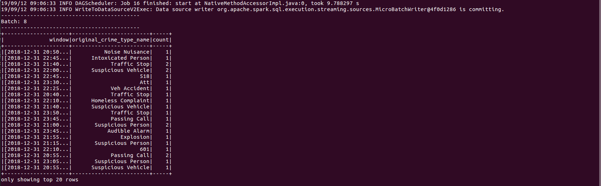

# SF Crime Statistics with Spark Streaming 

In this project, we were provided with a real-world dataset, extracted from Kaggle, on San Francisco crime incidents, and we will provide statistical analyses of the data using Apache Spark Structured Streaming. Then we will draw on the skills and knowledge we've learned in this course to create a Kafka server to produce data, and ingest data through Spark Structured Streaming.

The script `producer_server.py` and on running the kafka consumer, below is a screenshot of the result I got:

The script `data_stream.py` and running with `spark-submit --packages org.apache.spark:spark-sql-kafka-0-10_2.11:2.3.0 --master local[4] data_stream.py`, below is a screenshot of the result on batch 8 I got:

Finally, the `consumer_server.py` script to also demonstrate data consumption from the producer server script. Below is a screenshot of the result I got:

